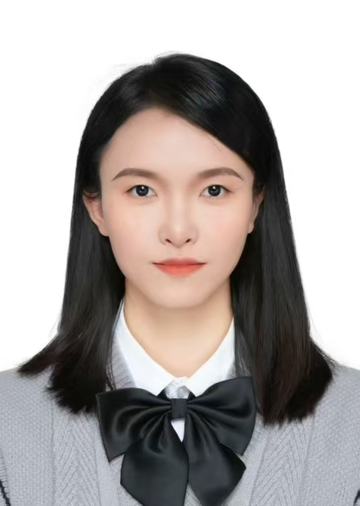

I am a graduate student specializing in artificial intelligence, computer vision, and multimodal learning.

My research interests include multimodal large language models, controllable image generation, reinforcement learning, and computer vision.

#### Contact

Email: your_email@example.com

GitHub: [cyzf1007hh](https://github.com/cyzf1007hh)

#### Education

**Nankai University**  
M.S. in Statistics, XXXX–Present

**Nankai University**  
B.S. in Statistics, XXXX–XXXX

#### Research Interests

- Multimodal Large Language Models
- Controllable Image Generation
- Reinforcement Learning
- Computer Vision
- Medical Artificial Intelligence